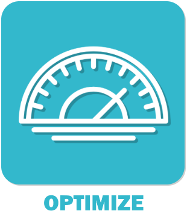

# Plugin Optimize pour Jeedom

Optimisez en quelques clics certains points de votre installation Jeedom.

### Documentation

Vous trouverez la documentation [ici](https://github.com/Sylvaner/JeedomPluginTutoriel2/tree/master/docs/fr_FR/index.asciidoc)

