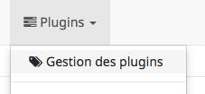
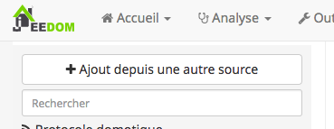

# Installation

This plugin does not respect Jeedom's CGU, you use it at your own risk and you can not hold Jeedom SAS responsible or the author of this plugin in case of malfunction.

## From Jeedom
In the __Management plugins__
<p align="center">
  
</p>

With the mouse, go to the left of the screen to bring up the vertical menu and click on __Add from another source__.
<p align="center">
  
</p>

In __ Source type__, select __URL__.
Then fill the 2 fields:
* Logical ID of the plugin: __Optimize__
* ZIP file URL: https://github.com/Jeedom-Plugins-Extra/plugin-Optimize/archive/master.zip
<p align="center">
  
</p>

Click on __Save__

## In console mode
Open an SSH connection on the server, then move to the __plugins__ directory of your Jeedom installation.
Usually :
```
cd / var / www / html / plugins
```

Then clone the GitHub repository:
```
sudo git clone https://github.com/Jeedom-Plugins-Extra/plugin-Optimize
```

Finally, rename and define the right user (www-data on debian-like).
```
sudo mv plugin-Optimize Optimize
sudo chown www-data: www-data-R Optimize
```