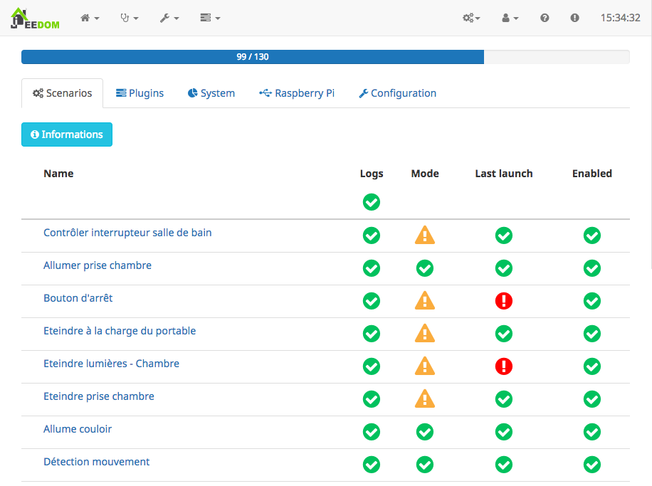

# Description

Optimize recherche et propose des solutions afin d'optimiser votre installation Jeedom.

Le plugin est composé principalement d'une page qui permet d'accéder à toutes les fonctionnalités.

# Les optimisations

### Les scénarios

* Logs : Chaque fois qu'un message est inscrit dans les logs, il est également écrit dans un fichier. Le gain de temps peut être négligeable, mais si votre Jeedom fonctionne sur un Raspberry, vous augmenterez la durée de vie de votre carte SD.
* Mode : Permet de passer le scénario en mode synchrone. Il se déclenchera et déroulera plus rapidement car aucun retour ne sera attendu après chaque commande. Cette option doit cependant être utilisée avec précaution surtout si vos scénarios s'appellent entre eux.
* Dernier lancement : Permet de détecter les scénarios qui ne se sont pas lancés depuis 30 jours.
* Activé : Un scénario désactivé est quand même stocké en base de données et est accédé par Jeedom régulièrement.

Un icône indique les scénarios en cours d'exécution.

### Les plugins

* Logs : Certains plugins génèrent beaucoup de logs. Il faut donc les désactiver pour les mêmes raisons que pour les scénarios.
* Chemin : Si vous avez installé vos plugins sans passer par le Market, vous aurez peut être de mauvais noms pour vos répertoires. Cette option permet de renommer selon les informations fournies par le plugin.
* Activé : Tout comme les scénarios, un plugin désactivé est quand même stocké et son répertoire est régulièrement parcouru par Jeedom.

### Système

* Logs : Comme pour les autres cas, si vous n'avez aucun problème avec votre installation, mieux vaut les désactiver,
* Minification de tous les fichiers Javascript de Jeedom,
* Minification de tous les fichiers CSS de Jeedom.

Pour ignorer un répertoire et ses sous-répertoires, il faut créer un fichier vide __.optimize-ignore__ à la racine.

### Raspberry Pi

Si Jeedom est installé sur un Raspberry Pi, vous pourrez :
* Limiter la mémoire vidéo,
* Limiter l'accès au cache L2 pour le processeur.
