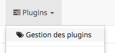
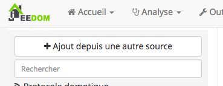
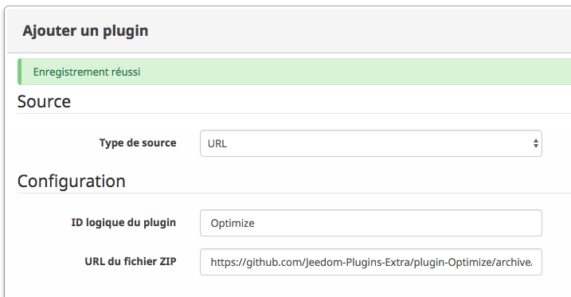

# Installation 

Ce plugin ne respectant pas les CGU de Jeedom, vous l'utilisez à vos propres risques et vous ne pouvez tenir pour responsable Jeedom SAS ou l'auteur de ce plugin en cas de dysfonctionnement.

## Depuis Jeedom
Dans la __Gestion des plugins__
<p align="center">
  
</p>

Avec la souris, aller sur la gauche de l'écran pour faire apparaitre le menu vertical et cliquer sur __Ajout depuis une autre source__.
<p align="center">
  
</p>

Dans __Type de source__, sélectioner __URL__.
Puis remplir les 2 champs : 
* ID logique du plugin : __Optimize__
* URL du fichier ZIP : https://github.com/Jeedom-Plugins-Extra/plugin-Optimize/archive/master.zip
<p align="center">
  
</p>

Cliquer sur __Enregistrer__

## En mode console
Ouvrir une connexion SSH sur le serveur, puis se positionner dans le répertoire __plugins__ de votre installation Jeedom.
En général : 
```
cd /var/www/html/plugins
```

Puis cloner le dépôt GitHub : 
```
sudo git clone https://github.com/Jeedom-Plugins-Extra/plugin-Optimize
```

Enfin, renommer et définir le bon utilisateur (www-data sur les debian-like).
```
sudo mv plugin-Optimize Optimize
sudo chown www-data:www-data -R Optimize
```


